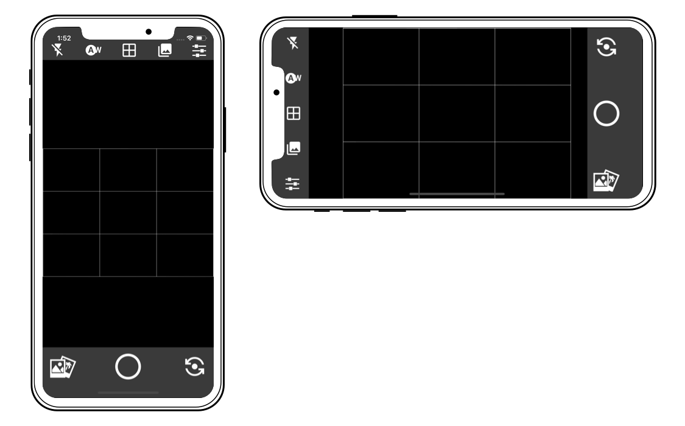

## React Native Camera App

A cross platform (iOS and Android) React Native Camera app.

### Installation

> **Note:** Be sure you have the React Native CLI [installed on your system](https://facebook.github.io/react-native/docs/getting-started).

- `git clone https://github.com/jqn/CameraApp.git`
- `cd CameraApp`
- `yarn install`/`npm install`
- `npx pod-install`
- `npx react-native start`

### Running

- `cd CameraApp`
- `npx react-native run-ios` or `npx react-native run-android`

---

This project was put together to serve as an example to help you in building your own React Native apps. Feel free to download it and tinker with it!

https://www.reactnativeschool.com/react-native-animatable-and-hooks-for-improved-error-messages

https://medium.com/swlh/converting-a-complex-react-native-class-component-to-hooks-a271d3ad8300

https://www.typescriptlang.org/

https://github.com/react-native-community/react-native-camera/blob/master/examples/advanced/advanced/src/screens/Camera.js

https://codedaily.io/tutorials/64/Create-a-Custom-Animated-Bottom-Action-Sheet-without-Measuring-in-React-Native

https://www.toptal.com/react-native/react-native-camera-tutorial

https://code.tutsplus.com/tutorials/common-react-native-app-layouts-gallery-page--cms-27642

Slider

https://github.com/KPS250/React-Native-FlatList-Slider

https://snack.expo.io/@hrastnik/carousel

https://dev.to/lloyds-digital/let-s-create-a-carousel-in-react-native-4ae2
