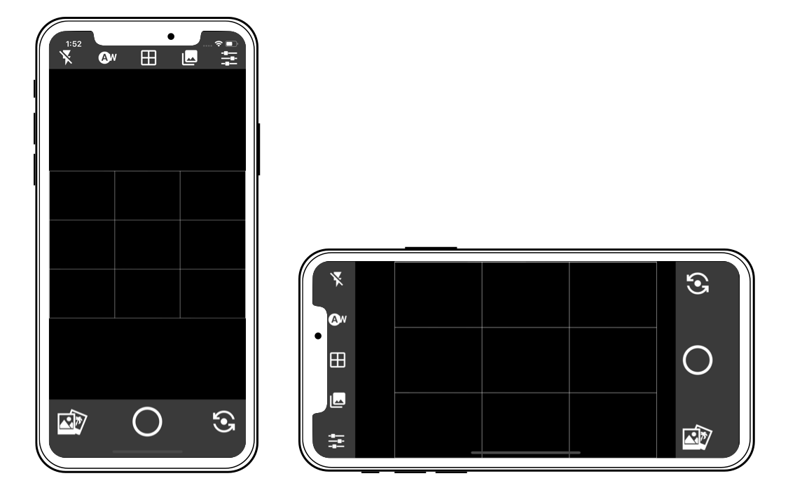

## React Native Social Media App

A cross platform (iOS and Android) React Native Camera app.

### Installation

> **Note:** Be sure you have the React Native CLI [installed on your system](https://facebook.github.io/react-native/docs/getting-started).

- `git clone https://github.com/ReactNativeSchool/react-native-social-media-app.git`
- `cd mobile`
- `yarn install`/`npm install`
- `(cd ios && pod install)`
- `cd ../server`
- `yarn install`/`npm install`

### Running Mobile

- `cd mobile`
- `yarn run ios`/`npm run ios` or `yarn run android`/`npm run android`

### Running Server

- `cd server`
- `yarn dev`

---

This project was put together to serve as an example to help you in building your own React Native apps. Feel free to download it and tinker with it!

https://www.reactnativeschool.com/react-native-animatable-and-hooks-for-improved-error-messages

https://medium.com/swlh/converting-a-complex-react-native-class-component-to-hooks-a271d3ad8300

https://www.typescriptlang.org/

https://github.com/react-native-community/react-native-camera/blob/master/examples/advanced/advanced/src/screens/Camera.js

https://codedaily.io/tutorials/64/Create-a-Custom-Animated-Bottom-Action-Sheet-without-Measuring-in-React-Native

https://www.toptal.com/react-native/react-native-camera-tutorial
